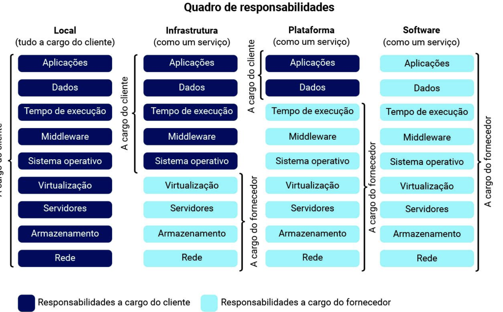

## Fundamentos de computação em nuvem

A computação em nuvem nada mais é que uma oferta de serviço de computação sob demanda e por meio da internet com pagamento baseado em uso. Com isso vem algumas facilidades e desafios, por conta que você consegue acessar qualquer dados em qualquer lugar, por outro lado a segurança bate na porta, então deve ter os seus cuidados.

*O uso do termo “nuvem” tem sua origem nos diagramas das antigas redes de dados ISDN (Services Digital Network ou rede de serviços digitais) e Frame Relay, projetadas pelas operadoras de telefonia.*

#### Vantagens

- Só paga pelo o que usa;
- Flexibilidade, agilidade e escalabilidade;

#### Desvantagens

- Necessidade de internet, então necessário uma internet confiável e boa;
- Os dados podem sofrer ataques;

#### Provedores

Empresa contratada para disponilizar uma infraestrutura, exemplo: Amazon Web Services AWS (Líder de mercado), Google Cloud Platform, Microsoft Azure, IBM Cloud, Oracle Cloud...

#### Linha do tempo

O sua surgimento está atrelado ao susrgimento da internet. 

Arpanet foi a primeira rede que permitiu o compartilhamento de informações entre computadores que não estavam no mesmo espaco físico.

Nos anos 2000 o cloud computing ficou mais comum no mundo da tecnologia, e daí então foi o começo da AWS onde começou a disponibilizar recursos para empresas e usuários alugarem uma parte de sua infraestrutura.

Em 2007 a Netflix lança o seu stream de vídeo onde os usuário poderiam assistir os vídeos de qualquer lugar do mundo.

A virtualização é um conceito que descreve a utilização de mais de um sistema operacional em um único servidor, simulando a estrutura de vários servidores físicos.

A computação em nuvem depende da virtualização de servidores, essa técnica é a essência do funcionamento da cloud computing.

### Modelos de computação em nuvem

#### Essência da computação em nuvem

-> Cinco características essênciais:
  - Autoatendimento sob demanda

  Acesso direto e sob demanda, garantindo que a alocação e a liberação de recursos ocorram sem a necessidade de interação humana entre o usuário e o provedor.

  - Amplo acesso à rede

  Capacidade da infraestrutura de rede de se conectar a uma ampla variedade de dispositivos, como telefones celulares, laptops, estações de trabalho e tablets, para permitir acesso contínuo aos recursos de computação nessas diversas plataformas.

  - Agrupamento de recursos

  Os recursos de computação do provedor são agrupados para atender a vários consumidores usando um modelo multilocatário, ou seja, os recursos computacionais são compartilhados entre diversos usuários, os quais não precisam ter conhecimento acerca da localização dos recursos que estão utilizando. Esses recursos computacionais devem ser abstraídos por dispositivos físicos reais, o que é alcançado na maioria das vezes por meio de virtualização.

  - Elasticidade dinâmica

  Capacidade de ampliar e reduzir conforme necessário, seja automática ou manualmente, sem a necessidade de lead times. Dessa maneira, a rápida alocação e liberação de recursos da nuvem a qualquer momento e conforme a demanda da aplicação proporciona ao usuário a não preocupação com a quantidade de recurso a que tem direito e tenha a sensação de capacidade de armazenamento infinita, podendo a qualquer momento requisitar recursos.

  - Serviço mensurável

  A capacidade de medir exatamente quais recursos estão sendo usados, monitorar e controlar esses serviços para podermos posteriormente apresentar esses dados ao cliente ou ao usuário final, por exemplo. O conceito de serviço mensurável contribuiu para o surgimento do modelo pay-as-you-go.

-> Três modelos de serviço:
  - Infraestrutura como um Serviço - (IaaS)
  - Plataforma como um Serviço (PaaS)
  - Software como um Serviço (SaaS)

-> Quatro modelos de implantação
  - Nuvem privada
  - Nuvem comunitária
  - Nuvem pública
  - Nuvem híbrida

### Camadas e atores na computação em nuvem

  - A camada de infraestrutura é a camada mais baixa. Nessa camada, os provedores de infraestrutura disponibilizam os serviços de armazenamento e rede. Nela encontram-se os servidores, os sistemas de armazenamento e os roteadores.

  - A camada de plataforma está relacionada com os serviços de aplicações que podem ser utilizadas para desenvolver, testar e implementar aplicações na nuvem.

  -A camada de aplicação fornece o maior nível de abstração, oferecendo diversas aplicações como serviços para serem consumidos pelos usuários.

  Visualizando:

  -> Aplicação:
    - Aplicações como serviços
    - Usuários de serviços

  -> Plataforma:
    - Desenvolvimento de aplicações
    - Prestadores de serviços

  -> Infraestrutura:
    - Serviços de rede e armazenamento
    - Prestadores de infraestrutura

  Os três principais atores da computação em nuvem são: os provedores de serviço, os usuários da nuvem e os provedores de infraestrutura.
 

#### Modelos de serviços para computação em nuvem

São três principais modelos de serviço de computação em nuvem

-> Infraestrutura como Serviço (IaaS)
  É um modelo de serviço de nuvem que permite ao usuário utilizar recursos de infraestrutura sob demanda, como armazenamento, virtualização e rede. Nesse cenário, os serviços de virtualização e rede são fornecidos pelo provedor enquanto o usuário cuida do sistema operacional, dos aplicativos e dados. Exemplos desse tipo de serviço incluem o serviço de máquinas virtuais do Azure e da AWS.

-> Plataforma como Serviço (PaaS)
  É um tipo de modelo de serviço de computação em nuvem que oferece uma plataforma de nuvem flexível e escalonável para desenvolver, implantar, executar e gerenciar apps. Nesse cenário, o usuário tem todas as ferramentas necessárias para criar aplicativos, as necessidades de software, hardware, rede e sistemas operacionais são atendidas pelo provedor de serviços. Exemplo desse tipo de serviço é o Google App Engine.

-> Software como Serviço (SaaS)
  É um modelo que permite aos usuários se conectar e usar aplicativos baseados em nuvem pela internet, como e-mail, serviços de armazenamento, entre outros. Nesse cenário, as necessidades de computação e armazenamento são atendidas pelo provedor de serviços em nuvem, o usuário só precisa fazer upload e baixar dados. Manutenção, tempo de inatividade, atualização e segurança são atendidos pelo provedor de serviços. Exemplos desse tipo de serviço são o Dropbox, Google APPS, Pipedrive e Shopify.

**Em resumo:**

- IaaS – Requer o máximo de gerenciamento do usuário entre os serviços da nuvem.
- PaaS – Requer menos gerenciamento do usuário.
- SaaS – Requer o mínimo de gerenciamento do usuário.

#### Nuvens públicas e privadas

-> Public Cloud - nuvem pública
  As nuvens públicas são aquelas nas quais os provedores de serviços disponibilizam todos os recursos, como computação, armazenamento e aplicativos para o público em geral pela internet. Qualquer usuário pode efetuar login e usar esses serviços. Você paga pelo número de recursos que usa. Nesse modelo, os usuários possuem menos controle sobre seus dados.

  -> Vantagens:
    - Preço;
    - Facilidade de contratação, configuração e infraestrutura;
    - Escalabilidade;
    - Performance;

  -> Desvantagens:
   - Segurança;
   - Controle feito por terceiros;
   - Requisitos legais;

-> Private Cloud – nuvem privada
  As nuvens privadas são ambientes de nuvem construídos exclusivamente para um único usuário, ou uma única empresa, normalmente localizados por trás do firewall do usuário.

  Ela oferece todos os benefícios da nuvem pública, como flexibilidade, escalabilidade, provisionamento, automação, monitoramento, entre outros, com a diferença de não ser dividida com outras empresas.

  Normalmente, esse tipo de nuvem é usado por organizações com foco na segurança de dados e que gerenciam dados muito sensíveis, como transações financeiras, por exemplo. Ela também pode ser empregada por empresas que possuem controle interno bem rígido.

  -> Vantagens:
    - Disponibilidade;
    - Customização de infraestrutura;
    - Suporte exclusivo;
    - Segurança;

  -> Desvantagens:
    - Custo inicial e a necessidade de uma equipe de TI própria.
    - O custo inicial é elevado, pois será necessário a compra do hardware, instalação e configuração. - E a contratação de profissionais de TI, pois são necessárias habilidades de TI pelo usuário ou empresa.

#### Nuvens híbridas e outros tipos

-> Hybrid cloud – nuvem híbrida
  As nuvens híbridas são aquelas constituídas pelos serviços da nuvem pública e privada. Alguns serviços são hospedados na nuvem privada, enquanto outros na nuvem pública. Assim, a empresa pode manter dados cruciais na nuvem privada e outros dados na nuvem pública, aproveitando o melhor dos dois mundos.

-> Community Cloud – nuvem comunitária
  As nuvens comunitárias são compartilhadas por diversas empresas que possuem interesses comuns, como a missão, os requisitos de segurança, políticas, entre outros. Nesse modelo, a nuvem comunitária pode ser administrada tanto pela própria organização ou por terceiros e pode existir tanto dentro (on premises) quanto fora (off premises) da organização.

-> Distributed Cloud – nuvem distribuída
  A nuvem distribuída se caracteriza pela possibilidade de ser acionada em diferentes localidades, mas possui servidores conectados a uma única rede ou hub de serviços. Optando por essa solução, a empresa garante o máximo de disponibilidade de seus recursos, além de uma baixa latência.

#### Conteinerização
  A conteinerização, também conhecida como virtualização baseada em contêineres, é um método utilizado na implantação e execução de aplicativos distribuídos sem a necessidade de configuração de uma virtual machine (VM) completa para cada um deles. Em vez disso, vários sistemas isolados, chamados de contêineres, são executados em um único host de controle, acessando um único kernel. E assim, surge o conceito de cloud containers ou contêineres na nuvem, isto é, virtualização baseada em contêiner, um modelo de virtualização na nuvem em nível de sistema operacional, com o objetivo de implantar e executar aplicativos distribuídos. Dessa forma, vários sistemas isolados são acionados em um único host, acessando um único kernel.

## Ambiente de Computação em Nuvem - Azure

#### Comparação de modelos de nuvem

1. Nuvem Privada
  - O hardware deve ser comprado para inicialização e manutenção;
  - As organizações têm controle total sobre os recursos e a segurança;
  - As organizações são responsáveis pela manutenção e pelas atualizações;

2. Nuvem Pública
  - Nenhuma despesa de capital para escalar verticalmente;
  - Os aplicativos podem ser provisionados e desprovisionados;
  - As organizações pagam apenas pelo que utilizam;

3. Nuvem Híbrida
  - Fornece a maior flexibilidade;
  - As organizações determinam onde executar seus aplicativos;
  - As organizações controlam a segurança, a conformidade ou requisitos legais;

#### A arquitetura e os serviços do Azure

As regiões do Azure são áreas geográficas do planeta que possuem ao menos um datacenter, e, possivelmente, vários outros próximos, o que proporciona redes de baixa latência conectada por redes de fibra ótica. Cada região garante a residência dos dados. Portanto, se uma máquina virtual for criada na região Sul do Brasil, por exemplo, a Microsoft garante que os dados estão localizados no Brasil. O Azure garante que as cargas de trabalho sejam balanceadas corretamente dentro das regiões disponibilizadas.

As zonas de disponibilidade são datacenters dentro da mesma região que são sepaarados fisicamente, mas conectados a uma rede de alta velocidade. Cada zona possui uma ou mais datacenters, geralmente até três com energia, refrigeração e rede independentes. Uma zona é um limite de isolamento de forma que, caso uma zona fique indisponível, as outras continuam funcionando.

Já os pares de regiões é o emparelhamento de regiões proporcionando a redução da possibilidade de interrupções devido a desastres naturais, quedas de energia, conflitos civis e interrupções de rede física na região específica. A maioria das regiões possui o seu par na mesma geografia, ou a pelo menos 300 milhas, ou 480km. laguns serviços do Azure já possuem, habilitados por padrão, essa configuração de regiões pares, possibilitando que, em caso de algum dos desastres citado, ocorra a migração do serviço para a região par.

## Ambiente de Computação em Nuvem - AWS

### Opções de computação na AWS

Confira métodos para conhecer e identificar o melhor uso das principais soluções de computação na Amazon Web Services, aprender quais são as principais características de uma máquina virtual no Amazon EC2, e como provisionar, usando de boas práticas, um servidor na AWS.

Para profissionais que irão gerir recursos computacionais na Amazon Web Services, a primeira decisão a ser tomada é sobre qual tipo de computação será provisionada. Essa é uma decisão muito importante, pois afeta toda a arquitetura da aplicação/serviço a ser hospedado e, por isso, você precisa conhecer qual é o produto ideal para cada caso. Basicamente, existem 3 opções de computação na AWS:

- Máquinas virtuais (VMs)

Geralmente, são a opção de computação mais fácil de se entender na AWS para quem tem conhecimento prévio de infraestrutura de TI, pois trata-se da virtualização de um servidor físico, que possui disco, placa de rede, e permite instalar e personalizar o ambiente de forma similar. A Amazon oferece opções de máquinas virtuais com sistema operacional e até algumas opções de softwares pré-instalados. Na AWS, as máquinas virtuais são chamadas de Amazon Elastic Compute Cloud (EC2).

- Containers

Com a escalada de aplicações na nuvem, soluções que oferecem maior velocidade de provisionamento e consistência de funcionamento independente do ambiente (no on-premise ou na cloud, em desenvolvimento ou em produção), tornaram-se cada vez mais populares e esses são alguns benefícios que estimulam o uso de containers na computação em nuvem. Um container é um padrão de empacotamento de código e dependências projetado para ser executado de forma confiável em qualquer plataforma. Na AWS é possível executar containers no Amazon Elastic Container Service (Amazon ECS) ou no Amazon Elastic Kubernetes Service (Amazon EKS).

- Computação sem servidor (serverless computing)

Uma das maiores vantagens da computação em nuvem é a abstração de hardware da camada de infraestrutura. Na computação sem servidor, a abstração sobe mais um nível, no qual não somente a camada física é abstraída, mas também a de sistema operacional e stack. Com esse nível de abstração, o foco passa a ser no código das suas aplicações, sem precisar gastar tempo mantendo e atualizando infraestrutura, servidores ou sistema operacional. Nesse modelo, você pagará apenas pelo tempo que sua aplicação executar. Na AWS, o principal serviço de computação sem servidor é o AWS Lambda.

### Máquinas virtuais – Amazon EC2

As máquinas virutais são um conjunto de infraestrutura onde você pode escolher como um self-service, tendo o controle de aumentar os recursos da infra quando precisar, desligar a máquina caso precise, e pode ser configurado em alguns minutos e ter ali facilmente uma infra esperando somente a aplicação ser adicionada. Essa facilidade fez com que muitas empresas largassem o ambiente on-promise e escolherem a nuvem.

### Amazon Machine Image (imagens de aplicações e sistema operacional)

No Amazon EC2, a responsabilidade da instalação do sistema operacional não é do usuário, pois a AWS fornece imagens prontas, conhecidas como Amazon Machine Images (AMI).

Além do sistema operacional, algumas imagens já podem vir com plataforma, aplicativos pré-instalados e suas dependências. A AWS fornece um catálogo de milhares de imagens prontas para uso fornecidas pela própria Amazon e por empresas parceiras, por meio de um marketplace ou da comunidade, que oferece imagens customizadas disponibilizadas por outros usuários da nuvem. Existe uma diversidade de opções de sistemas operacionais e suas variações, que podem ser selecionadas a depender da versão e, em alguns casos, da arquitetura disponível.

AMIs podem ser criadas pelo usuário a partir de uma instância em execução e isso permite sua customização e reutilização para novos provisionamentos de sistemas, com configurações próprias para o seu cenário

### Par de chaves

Durante o processo de lançamento de uma instância EC2, é solicitado que você selecione um key pair (par de chaves) ou que crie um, caso ainda não tenha feito. Esse par de chaves consiste em uma chave pública e uma chave privada. O Amazon EC2 armazena a chave pública em sua instância e você deve armazenar de forma segura a chave privada, pois qualquer um de posse dela pode conectar-se na sua instância.

### Rede e firewall de EC2

O Amazon VPC permite que você execute recursos da AWS em uma rede virtual dedicada à sua conta, conhecida como **nuvem privada virtual (VPC)**. Ao iniciar uma instância, você pode selecionar uma sub-rede da VPC (ou deixar que a AWS escolha por você). A instância é configurada com uma interface de rede primária, que é uma placa de rede virtual lógica. A instância recebe um endereço IP privado primário do endereço IPv4 da sub-rede, que é atribuído à interface de rede primária. Você pode controlar também se a instância receberá um endereço IP público do pool de endereços IP públicos da Amazon. O endereço IP público de uma instância é associado à sua instância somente até que ela seja desligada ou encerrada. Se você precisar de um endereço IP público persistente, poderá alocar um endereço IP elástico para sua conta da AWS e associá-lo a uma instância ou interface de rede.

### Disco do EC2

O Amazon EC2 oferece opções de armazenamento de dados para suas instâncias que são flexíveis, econômicas e fáceis de usar. Cada opção tem uma combinação única de desempenho e durabilidade. Em geral, durante a criação de uma instância EC2, um disco raiz EBS (Elastic Block Store) de tamanho mínimo e tipo sugerido para a AMI selecionada já é adicionado, podendo ser alterado e até adicionados novos tipos de armazenamento.

### Block Storage - Amazon EBS

O Amazon Elastic Block Storage é um serviço que fornece volumes de armazenamento em blocos, e que pode ser usado com instâncias EC2. Se você desligar ou apagar uma instância do Amazon EC2, todos os dados no volume do EBS anexo permanecerão disponíveis, permitindo reanexar a uma instância.

Depois de criar um volume do EBS, ele pode ser anexado a uma instância do Amazon EC2, similar à forma como você anexa um HD externo ao seu computador. Os volumes EBS agem de forma muito parecida a um HD externo. Grande parte dos volumes do Amazon EBS só pode ser conectada a uma instância por vez. A maioria dos volumes do EBS tem uma relação um para um com instâncias do EC2, portanto, eles não podem ser compartilhados ou anexados a várias instâncias ao mesmo tempo (recentemente, a AWS anunciou o recurso multi-atach do Amazon EBS, que permite que volumes sejam anexados a várias instâncias do EC2 ao mesmo tempo. Esse recurso não está disponível para todos os tipos de instância e todas as instâncias devem estar na mesma zona de disponibilidade).

### Snapshots de EBS

Como os volumes do EBS são para dados que precisam perdurar, é importante fazer backup dos dados. Você pode fazer backups complementares de volumes do EBS criando snapshots do Amazon EBS.

Um snapshot do EBS é um backup incremental. Isso significa que o primeiro backup de um volume copia todos os dados. Nos backups subsequentes, somente os blocos de dados que foram alterados desde o snapshot mais recente serão salvos.

O Amazon EBS é útil quando você precisa recuperar dados rapidamente e manter os dados por um longo prazo.

### Object storage - Amazon S3

Ao contrário do Amazon Elastic Block Store (Amazon EBS), o Amazon Simple Storage Service (Amazon S3) é uma solução de armazenamento independente, que não está vinculada à computação e permite que você recupere seus dados de qualquer lugar na web. Nesse serviço, você armazena seus objetos em contêineres chamados de buckets (baldes).

### Versionamento no S3

Ao carregar uma foto, você pode nomear o objeto photo.gif e armazená-lo em uma pasta chamada PhotosFiles. Se você não usar o controle de versão do Amazon S3, toda vez que fizer upload de um objeto chamado photo.gif para a pasta PhotosFiles, ele substituirá o arquivo original. O controle de versão mantém várias versões de um único objeto no mesmo bucket. Isso preserva versões antigas de um objeto sem usar nomes diferentes, o que ajuda na recuperação de arquivos de exclusões acidentais, substituições acidentais ou falhas de aplicativos.

### File storage – Amazon EFS

No armazenamento de arquivos, vários clientes (como usuários, aplicativos, servidores e assim por diante) podem acessar dados armazenados em pastas de arquivos compartilhadas. Nessa abordagem, um servidor de armazenamento organiza os arquivos por meio do uso de armazenamento em bloco, com um sistema local de arquivos. Os clientes acessam os dados por meio de caminhos de arquivo. Comparado ao armazenamento em blocos e ao armazenamento de objetos, o armazenamento de arquivos é ideal para casos de uso em que muitos serviços e recursos precisam acessar os mesmos dados ao mesmo tempo. O Amazon Elastic File System (Amazon EFS) é um sistema de arquivos escalável, usado com os serviços de nuvem AWS e recursos locais. À medida que você adiciona e remove arquivos, o Amazon EFS expande e retrai automaticamente, de forma que pode dimensionar sob demanda para petabytes sem interromper os aplicativos.

### VPC – Virtual Private Cloud

Esse serviço permite que você provisione uma seção isolada da nuvem AWS. Nessa seção, você pode executar os recursos em uma rede virtual que definir. Em uma Virtual Private Cloud (VPC), você pode organizar seus recursos em sub-redes. Uma sub-rede é uma seção de uma VPC que pode conter recursos como instâncias do Amazon EC2.

### Sub-redes de VPC

Depois de criar sua VPC, você deve criar sub-redes dentro da rede. Pense nelas como redes menores dentro de sua rede base – ou redes locais virtuais (VLANs) em uma rede local tradicional. Em uma rede local, o caso de uso típico para sub-redes é isolar ou otimizar o tráfego de rede. Na AWS, essas sub-redes são usadas para fornecer alta disponibilidade e opções de conectividade para seus recursos.

### Gateway de internet (internet gateway)

Para habilitar a conectividade para sua VPC, você deve criar um gateway de internet. Pense nele como algo semelhante a um modem. Da mesma forma que um modem conecta seu computador à internet, o gateway conecta sua VPC. Ao contrário do seu modem em casa, que às vezes fica inativo ou offline, o gateway de internet é altamente disponível e escalável, abrangendo todas as AZs disponíveis. Depois de criar um gateway da internet, você o anexa à sua VPC.

### Gateway NAT

Um gateway NAT é um serviço de Network Address Translation (NAT) que pode ser usado para que as instâncias em uma sub-rede privada possam se conectar a serviços fora de sua VPC, mas os serviços externos não podem iniciar uma conexão com essas instâncias.

### VPC padrão

Ao criar uma conta na AWS, você já encontra uma VPC padrão (default) em cada região (a própria AWS já deixou isso pré-provisionado). Uma VPC padrão vem com uma sub-rede pública em cada zona de disponibilidade, um gateway de internet e configurações para habilitar a resolução de DNS, permitindo que você possa iniciar imediatamente as instâncias do Amazon EC2.

